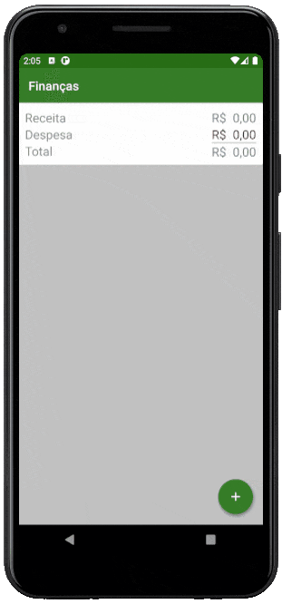

<h1 align="center">
 Alura - Desenvolvimento mobile com Kotlin
</h1>
 

  <a href="#-projeto">Projeto</a>&nbsp;&nbsp;&nbsp;|&nbsp;&nbsp;&nbsp;
  <a href="#-curso">Curso</a>&nbsp;&nbsp;&nbsp;|&nbsp;&nbsp;&nbsp;
  <a href="#%EF%B8%8F-desenvolvimento">Desenvolvimento</a>&nbsp;&nbsp;&nbsp;

 
 
## ✨ Projeto
 
O projeto consiste em uma aplicação para gerenciar finanças. O usuário consegue adicionar, editar e remover receitas ou despesas. Conforme os dados são adicionados é possível visualizá-los por meio de uma lista. Na parte superior temos um resumo contendo o resultado de todas as operações. Um breve exemplo, pode ser visto a seguir:

  

 
## 📚 Curso
 
- [Kotlin parte 1: Sua primeira app android na linguagem](https://cursos.alura.com.br/course/android-com-kotlin-parte-1)
  - Crie sua primeira app Android com suporte ao Kotlin
  - Construa classes modelos e entenda o que são properties
  - Adicione comportamentos em outras classes com a extension function
  - Crie classes enums
  - Entenda as possibilidades de sobrecarga
  - Concatene String utilizando String Templates
  - Aprenda a criar variáveis com o if expression
  - Refatore o código visando as boas práticas de programação

- [Kotlin parte 2: Mais recursos da linguagem e boas práticas](https://cursos.alura.com.br/course/android-com-kotlin-parte-2)
  - Entenda como funcionam os operadores lógicos durante a comparação
  - Chame mais de um membro de um objeto chamando-o uma única vez
  - Conheça alguns recursos funcionais e utilize expressões lambda
  - Converta funções em Single-Expression Function
  - Crie Dialogs, DatePickers e Spinners do Android
  - Implemente interfaces do Java com expressão lambda
  - Entenda como funciona as Exceptions e o Try-Expression

- [Kotlin parte 3: Técnicas avançadas na sua app](https://cursos.alura.com.br/course/android-kotlin-parte-3)
  - Entenda o que é o Null Safety
  - Conheça novas técnicas de inicialização
  - Aumente a flexibilidade com herança
  - Declare e implemente Higher-Order Functions
  - Aplique menu de contexto
  - Declare Companion Objects
 
## 🛠️ Desenvolvimento
 
- [Kotlin](https://kotlinlang.org/)
- [Android](https://developer.android.com/kotlin)
 
 
 
---
 
 
 

 

