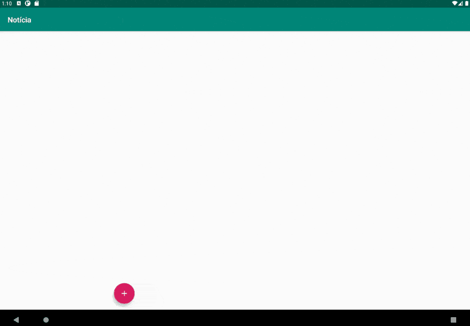
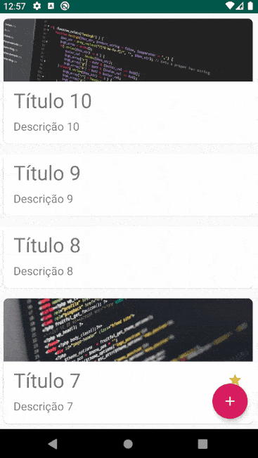

<h1 align="center">
 Alura - Desenvolvimento mobile com Kotlin
</h1>
 

  <a href="#-projetos">Projetos</a>&nbsp;&nbsp;&nbsp;|&nbsp;&nbsp;&nbsp;
  <a href="#-cursos">Cursos</a>&nbsp;&nbsp;&nbsp;|&nbsp;&nbsp;&nbsp;
  <a href="#%EF%B8%8F-desenvolvimento">Desenvolvimento</a>&nbsp;&nbsp;&nbsp;

 

## ✨ Projetos
 
- [Finances](https://github.com/gustavofariaa/AndroidKotlinUdemy/tree/main/Finances)
  

    
  

- [TechNews](https://github.com/gustavofariaa/AndroidKotlinUdemy/tree/main/TechNews)
  

    
  

    

    
  

- [AluraEsporte](https://github.com/gustavofariaa/AndroidKotlinUdemy/tree/main/AluraEsporte)
  

    
  

- [DataBinding](https://github.com/gustavofariaa/AndroidKotlinUdemy/tree/main/DataBinding)
  

    
  

 
## 📚 Cursos
 
- [Kotlin parte 1: Sua primeira app android na linguagem](https://cursos.alura.com.br/course/android-com-kotlin-parte-1)
  - Crie sua primeira app Android com suporte ao Kotlin
  - Construa classes modelos e entenda o que são properties
  - Adicione comportamentos em outras classes com a extension function
  - Crie classes enums
  - Entenda as possibilidades de sobrecarga
  - Concatene String utilizando String Templates
  - Aprenda a criar variáveis com o if expression
  - Refatore o código visando as boas práticas de programação

- [Kotlin parte 2: Mais recursos da linguagem e boas práticas](https://cursos.alura.com.br/course/android-com-kotlin-parte-2)
  - Entenda como funcionam os operadores lógicos durante a comparação
  - Chame mais de um membro de um objeto chamando-o uma única vez
  - Conheça alguns recursos funcionais e utilize expressões lambda
  - Converta funções em Single-Expression Function
  - Crie Dialogs, DatePickers e Spinners do Android
  - Implemente interfaces do Java com expressão lambda
  - Entenda como funciona as Exceptions e o Try-Expression

- [Kotlin parte 3: Técnicas avançadas na sua app](https://cursos.alura.com.br/course/android-kotlin-parte-3)
  - Entenda o que é o Null Safety
  - Conheça novas técnicas de inicialização
  - Aumente a flexibilidade com herança
  - Declare e implemente Higher-Order Functions
  - Aplique menu de contexto
  - Declare Companion Objects

- [Architecture Components: ViewModel, LiveData e Room](https://cursos.alura.com.br/course/android-archtecture-components)
  - Conhecendo o projeto Ver primeiro vídeo
  - Começando a implementação do ViewModel
  - Integrando o ViewModel com o LiveData
  - Ajustando as demais funcionalidades com o novo modelo
  - Utilizando a integração entre LiveData e Room

- [Injeção de dependência em projetos Android com Koin - Parte 1](https://cursos.alura.com.br/injecao-de-dependencia-em-projetos-android-com-koin-parte-1-c48)

- [Injeção de dependência em projetos Android com Koin - Parte 2](https://cursos.alura.com.br/injecao-de-dependencia-em-projetos-android-com-koin-parte-2-c49)

- [Android Fragments: Reutilizando componentes visuais](https://cursos.alura.com.br/course/android-fragments)
  - Migrando lista de notícias para fragment Ver primeiro vídeo
  - Implementando Fragments programaticamente
  - Evitando problemas comuns na reutilização de Fragments
  - Reutilizando Fragments em layouts de multiplos painéis
  - Melhorando a flexibilidade no uso de múltiplos painéis

- [Navigation parte 1: Transição de telas no Android](https://cursos.alura.com.br/course/android-navigation)
  - Migrando lista de notícias para fragment Ver primeiro vídeo
  - Configurando destinos
  - Ajustando a back stack
  - Configurando ações
  - Aplicando os toques finais

- [Navigation parte 2: Novas features e reutilização de código](https://cursos.alura.com.br/course/android-navigation-features)
  - Aplicando a navegação condicional Ver primeiro vídeo
  - Reutilizando conexões com ações globais
  - Utilizando técnicas de reaproveitamento de código
  - Flexibilizando a adição de novos destinos
  - Integrando componentes visuais com o Navigation UI

- [Data Binding no Android: vinculando modelo com layout](https://cursos.alura.com.br/course/android-data-binding)
  - Utilizando o binding de views Ver primeiro vídeo
  - Implementando Binding Adapters
  - Lidando com event listeners
  - Entendendo one-way e two-way Data Binding
  - Campos observáveis e LiveData
 
## 🛠️ Desenvolvimento
 
- [Kotlin](https://kotlinlang.org/)
- [Android](https://developer.android.com/kotlin)
 
 
 
---
 
 
 

 

